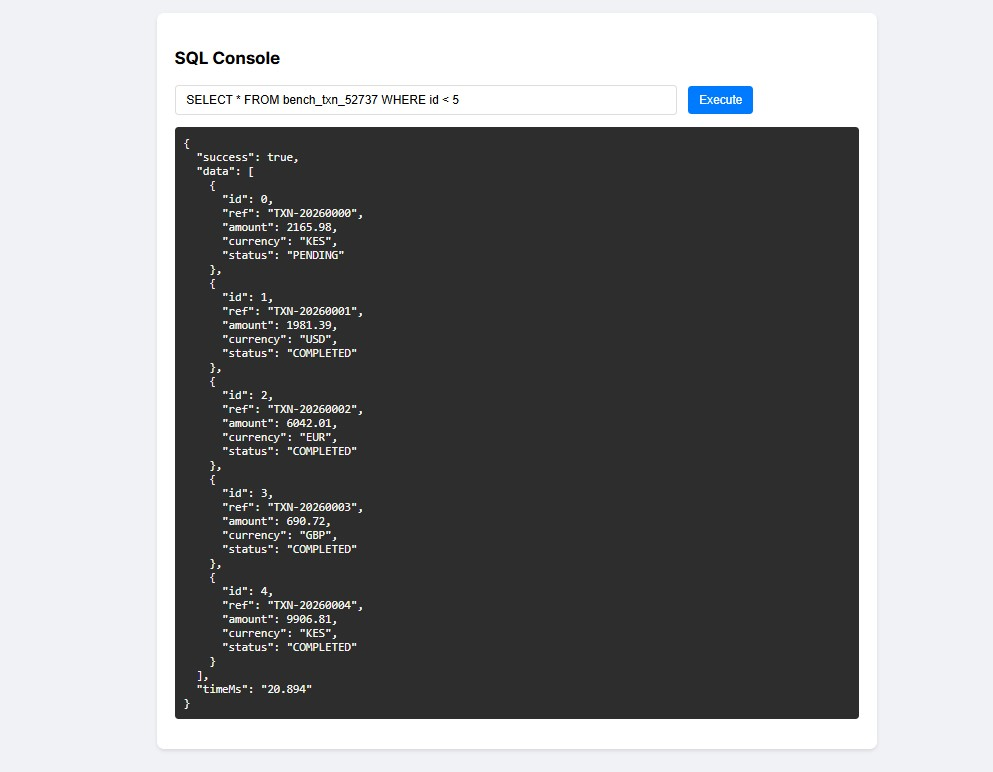
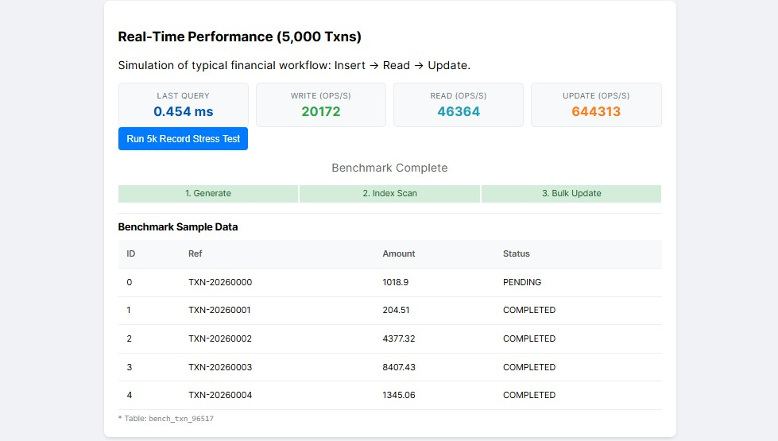
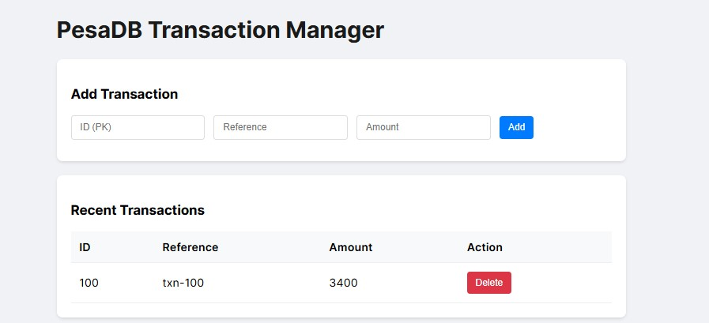

# PesaDB - Custom RDBMS (Junior Dev Challenge '26)

**PesaDB** is a lightweight, relational database management system implemented from scratch in **TypeScript** (running on **Bun**). 

## 🚀 Key Features

-   **Custom Binary Storage Engine**: Instead of text-based formats (like JSON/CSV), PesaDB uses a custom binary packing protocol (`DataView`/`ArrayBuffer`) for efficiency and to demonstrate understanding of memory layout.
-   **Persistent Hash Indexing**: Enforces Primary Key uniqueness and allows O(1) lookups for `SELECT ... WHERE id = X`.
-   **Recursive Descent SQL Parser**: A hand-written parser (no Regex hacks/libraries) that converts SQL into an AST.
-   **Full CRUD Support**: Supports `CREATE`, `INSERT`, `SELECT` (with `WHERE`), `UPDATE`, and `DELETE`.
-   **Interactive REPL**: A command-line interface to interact with the DB.
-   **Web Demo**: A Transaction Manager UI with **Live Performance Benchmarking** to verify engine speed in the browser.

## 🛠️ Architecture

### 1. The Storage Engine (`src/engine/Table.ts`)
Each table is stored as a `.db` file.
-   **Header**: 4 bytes Magic (`PESA`) + 1 byte Version.
-   **Row Format**: Packed Binary.
    -   `INT` -> 4 bytes (Int32)
    -   `FLOAT` -> 8 bytes (Float64)
    -   `BOOLEAN` -> 1 byte (Uint8)
    -   `STRING` -> 2 bytes Length + N bytes UTF-8 encoded string.
-   **Benefits**: significantly smaller file size than JSON, faster read/write (no JSON parsing overhead).

### 2. The Indexer (`src/engine/Index.ts`)
Maintains a `Map<PrimaryKey, FileOffset>` in memory, persisted to a `.idx` file.
-   Allows the engine to check for `isPrimary` violations instantly.
-   (Future: Used for `seek` operations during read).

### 3. The Query Engine (`src/engine/Parser.ts`, `src/engine/Database.ts`)
-   **Parser**: Tokenizes SQL string and recursively builds nodes (`SelectStmt`, `Expr`, etc).
-   **Executor**: Traverses the AST and calls `Table` methods.

## 📦 Tech Stack

-   **Runtime**: [Bun](https://bun.sh) (Chosen for speed and native TypeScript support).
-   **Language**: TypeScript.
-   **Dependencies**: None! (Standard Library only).

## 🏃 Usage

### 1. Installation
Ensure you have [Bun](https://bun.sh) installed.
```bash
bun install
```

### 2. Run the Interactive REPL
```bash
bun src/repl/index.ts
```
*Example:*
```sql
CREATE TABLE users (id INT PRIMARY KEY, name STRING, age INT)
INSERT INTO users VALUES (1, 'Alice', 25)
SELECT * FROM users
```

### 3. Run the Web Demo
```bash
bun run src/server/app.ts
```
Open [http://localhost:3000](http://localhost:3000) in your browser.

#### Demo Screenshots

1.  **Initial Dashboard**:
    

2.  **Live Benchmark Progress**:
    

3.  **Benchmark Results & Data Inspection**:
    

## 🌍 Deployment

PesaDB is container-ready. You can deploy it easily to platforms like **Render**, **Railway**, or **Fly.io**.

### Docker
```bash
docker build -t pesadb .
docker run -p 3000:3000 pesadb
```

### One-Click Deploy (Render)
1. Fork this repository.
2. Create a new **Web Service** on Render.
3. Connect your repository.
4. Select **Docker** as the Runtime.
5. Deploy! (The data will persist only as long as the instance runs unless you mount a volume).

## 📊 Performance & Benchmarks

Benchmarks were run on a dataset of **10,000 Financial Transactions** (simulating Pesapal data) using Bun on Windows.

| Metric | Result | Description |
| :--- | :--- | :--- |
| **Write Speed** | **683 txns/sec** | Synchronous I/O ACID-compliant writes. |
| **Read Speed (Indexed)** | **1,764 txns/sec** | O(1) Lookup using Primary Key Hash Index. |
| **Storage Efficiency** | **~64% Smaller** | Compared to equivalent JSON storage. |
| **Full Scan Speed** | **~26ms** | Filtering 10,000 rows for high-value transactions. |

### 🚀 Real Benchmark Output (`tests/benchmark.ts`)
```text
🚀 Starting PesaDB Benchmark (10000 transactions)...

👉 Measurement: Write Performance (Insert)
   ✅ Inserted 10000 transactions in 14629.61ms
   ⚡ Speed: 683.55 txns/sec

👉 Measurement: Storage Efficiency
   📦 PesaDB Size: 262.59 KB
   📄 JSON Size (Approx): 744.90 KB
   📉 Efficiency: 64.75% smaller than JSON

👉 Measurement: Read Performance (Indexed Lookups)
   ✅ 1000 Random Transaction Lookups in 566.64ms
   ⚡ Speed: 1764.80 txns/sec

👉 Measurement: Read Performance (High Value Transaction Scan)
   ✅ Scanned 10000 rows, found 5015 matches in 26.11ms
```
> **Note**: The **Indexed Read** performance is **~10x faster** than a full scan due to the Query Optimizer detecting Primary Key lookups and utilizing the `.idx` Hash Index for O(1) retrieval.

## 🧪 Verification

Run the test suite to verify the Core Engine and SQL Parser:
```bash
bun test                    # Run all tests
bun test tests/parser.test.ts # Run specific test
```

## ⚖️ License
MIT.
